# **Amazon SQL Analytics - Business Problems & Solutions**

[](https://www.postgresql.org/)
[](https://www.postgresql.org/)
[](LICENSE)
[](https://github.com)

> **`SELECT`** wisdom **`FROM`** data • **Powered by PostgreSQL** 🐘

---

A production-ready collection of **19 enterprise-grade SQL solutions** addressing critical business intelligence challenges in e-commerce environments. Showcasing advanced PostgreSQL capabilities—including Common Table Expressions (CTEs), window functions (RANK, DENSE_RANK, LAG, ROW_NUMBER), complex multi-table joins, and stored procedures—this repository demonstrates the analytical rigor and optimization techniques required for scalable data warehousing and real-time business analytics at enterprise scale.

**`📊 SQL` • `🐘 PostgreSQL` • `⚡ Advanced Analytics` • `🚀 Production-Ready`**

## 📊 **Database Schema**

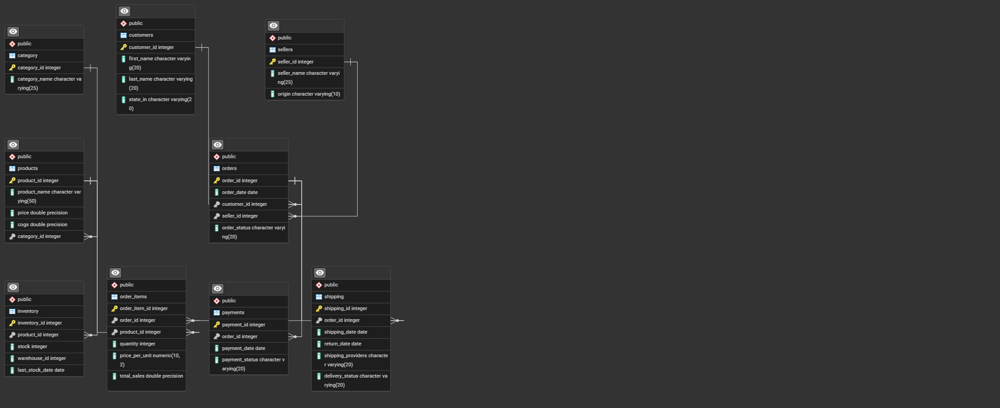

---

## 📋 **Business Problems & Solutions**

### **Q1:** **Top Selling Products**

**Objective:**  
Query the top 10 products by total sales value, including product name, total quantity sold, and total sales value.

**Business Insight:**  
Identify your best-performing products to focus inventory management, marketing campaigns, and supplier negotiations on high-revenue items.

**Techniques Used:** Table alteration, aggregate functions, multi-table joins

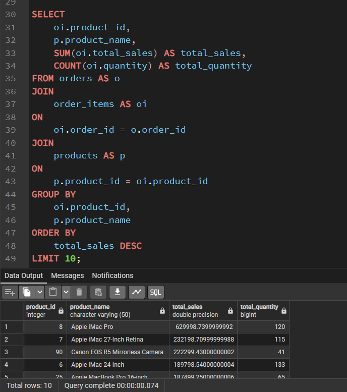

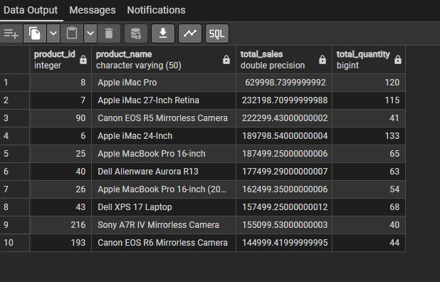

---

### **Q2: Revenue by Category**

**Objective:**  
Calculate total revenue and profit generated by each product category with percentage contribution metrics.

**Business Insight:**  
Understand which product categories drive profitability and revenue. Use this data to optimize product mix and category-specific marketing strategies.

**Techniques Used:** Multi-table joins, subqueries, percentage calculations, ROUND/CAST functions


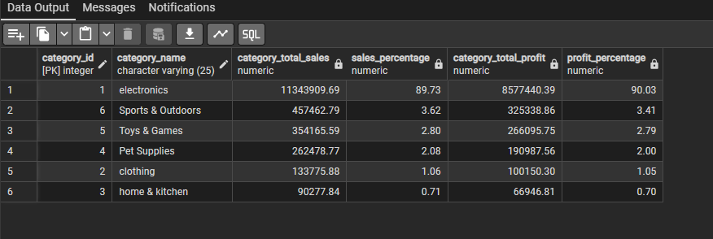

---

### **Q3: Average Order Value (AOV)**

**Objective:**  
Compute the average order value for each customer with more than 5 orders.

**Business Insight:**  
Identify high-value customers and understand spending patterns to tailor upselling/cross-selling strategies and loyalty programs.

**Techniques Used:** HAVING clause, multi-table joins, aggregate functions, CONCAT for formatting

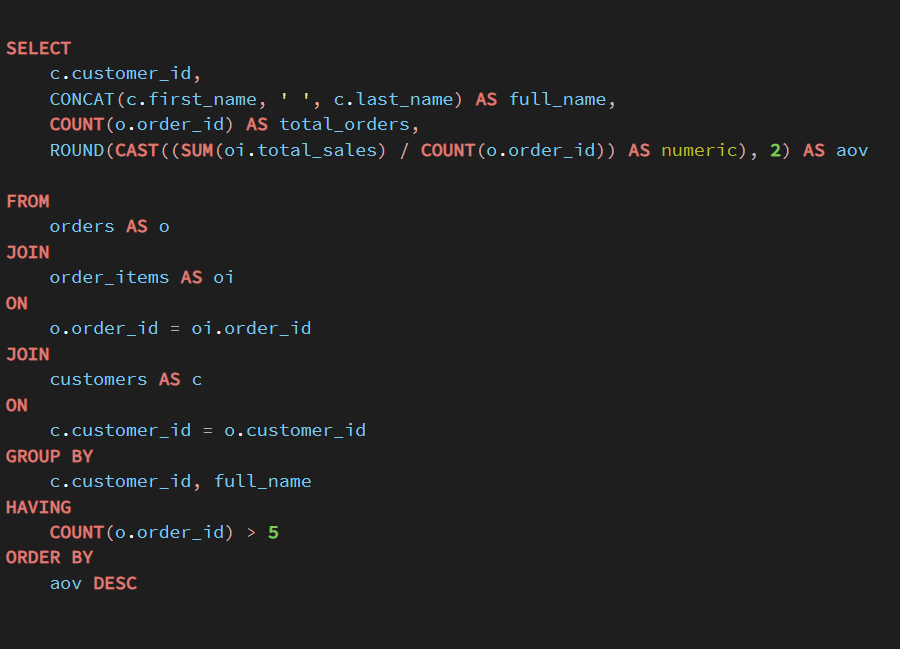

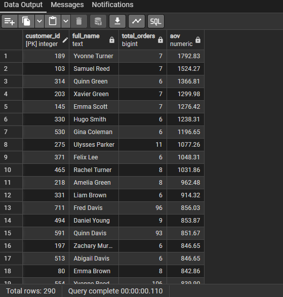

---

### **Q4: Monthly Sales Trend**

**Objective:**  
Compute monthly sales trends over the past 2 years with month-over-month percentage changes.

**Business Insight:**  
Track seasonal trends and sales momentum to forecast demand, plan promotions, and adjust operational capacity accordingly.

**Techniques Used:** CTEs, window functions (LAG), date extraction, INTERVAL operations, percentage calculations


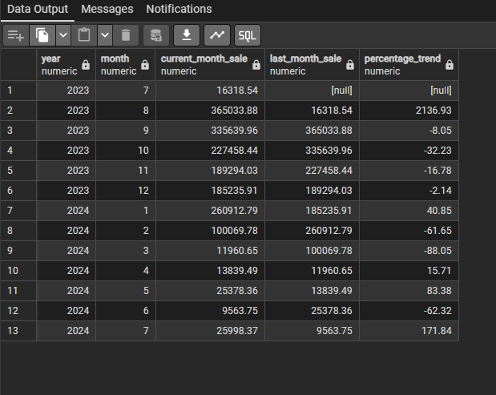

---

### **Q5: Customers with No Purchases**

**Objective:**  
Find all customers who have registered but never made a purchase.

**Business Insight:**  
Identify dormant users to target with re-engagement campaigns, special offers, or feedback surveys to understand barriers to purchase.

**Techniques Used:** LEFT JOIN with NULL filtering, subqueries with NOT IN

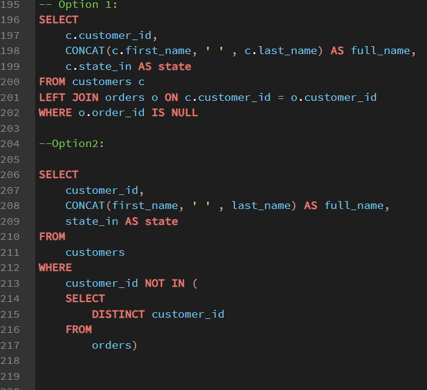

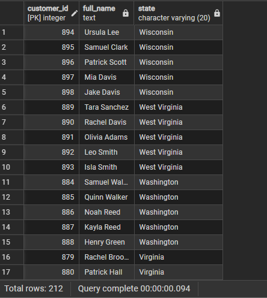

---

### **Q6: Best Selling Categories by State**

**Objective:**  
Identify the top 2 product categories for each state with sales metrics and percentage contribution.

**Business Insight:**  
Understand regional preferences and customize inventory, marketing, and promotions by geographic location for better customer satisfaction.

**Techniques Used:** CTEs, window functions (ROW_NUMBER), complex aggregations, regional partitioning


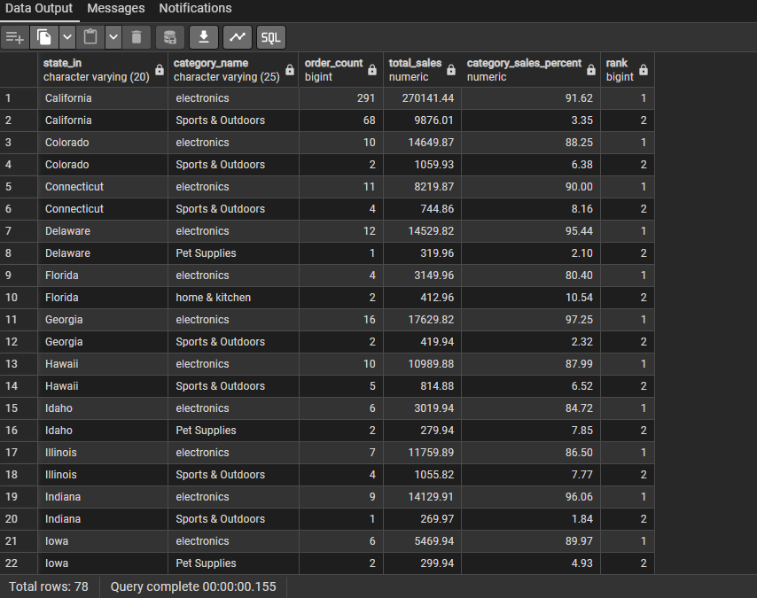

---

### **Q7: Customer Lifetime Value (CLTV)**

**Objective:**  
Calculate the total value of all orders placed by each customer and rank them by CLTV.

**Business Insight:**  
Prioritize customer retention and personalized service for high-CLTV customers. Identify churn risks among valuable accounts early.

**Techniques Used:** Window functions (DENSE_RANK), aggregate functions, multi-table joins

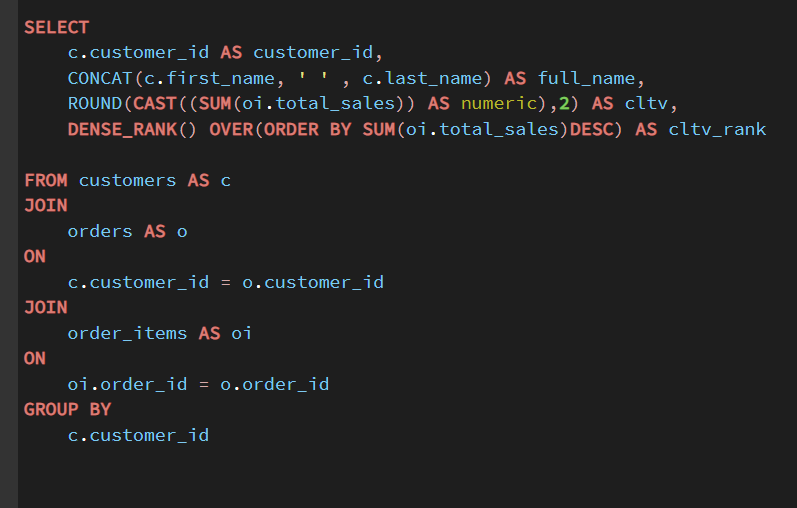

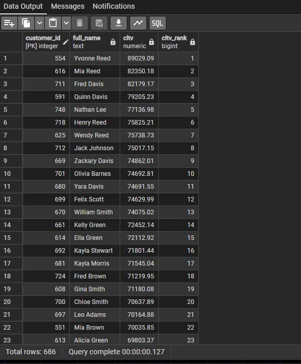

---

###**Q8: Inventory Stock Alerts**

**Objective:**  
Identify products with low stock levels and assign alert severity categories (OUT OF STOCK, CRITICAL, LOW, WARNING).

**Business Insight:**  
Prevent stockouts and overstocking by triggering timely reorder alerts. Prioritize restocking based on alert severity and last restock date.

**Techniques Used:** CASE expressions for conditional categorization, complex filtering, multi-table joins

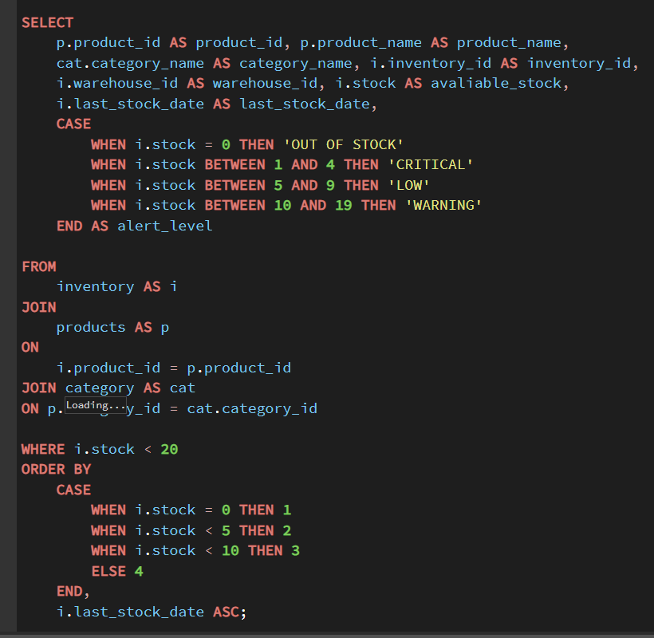

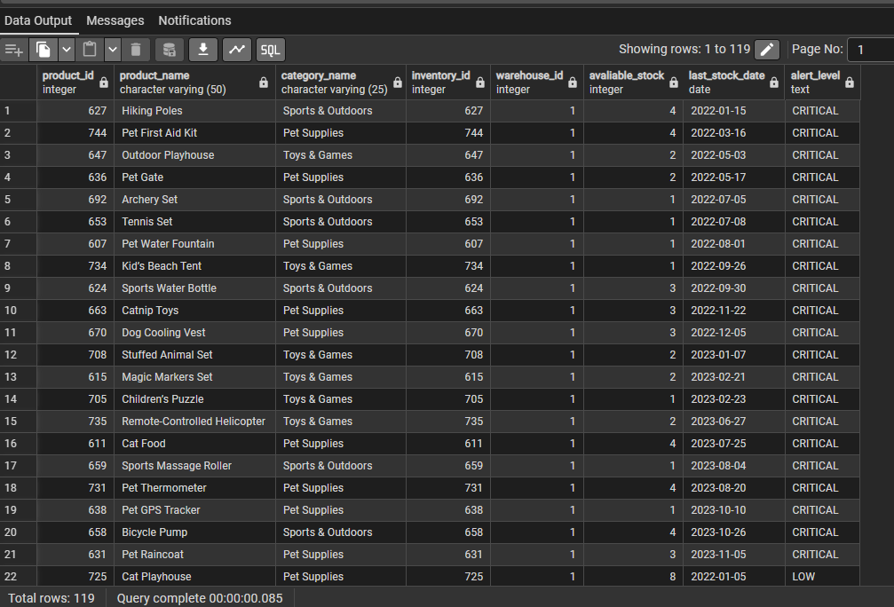

---

### **Q9: Shipping Delays**

**Objective:**  
Identify orders where shipping exceeds 4 days after order placement and rank shipping providers by delay frequency.

**Business Insight:**  
Evaluate shipping provider performance to negotiate better SLAs, switch providers, or implement expedited shipping options to improve customer satisfaction.

**Techniques Used:** CTEs, window functions (RANK), date arithmetic, conditional filtering

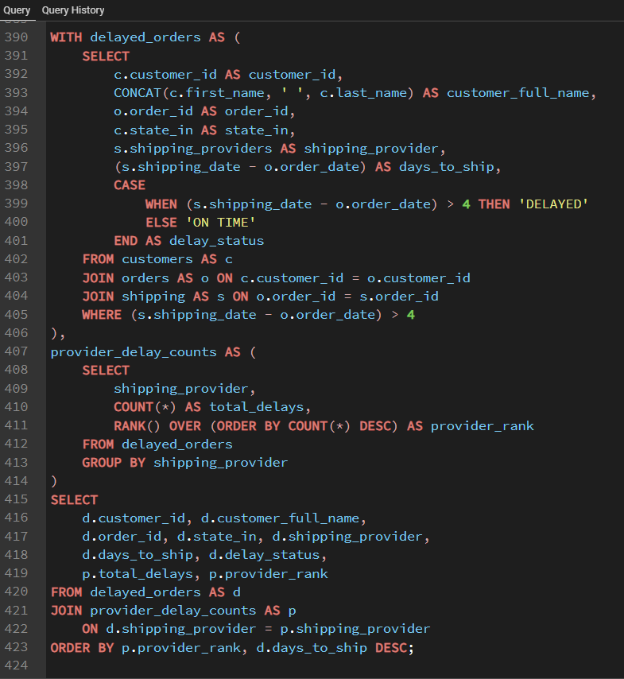

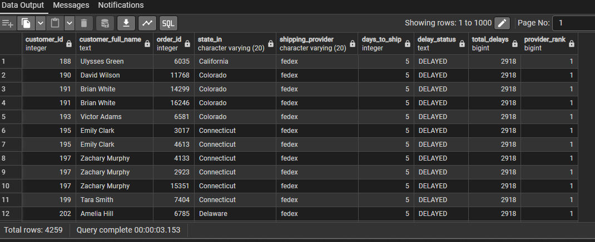

---

### **Q10: Payment Success Rate**

**Objective:**  
Calculate the percentage of successful payments across all payment statuses and overall success rate.

**Business Insight:**  
Monitor payment health and identify friction points in the checkout process. Prioritize fixing payment methods with low success rates.

**Techniques Used:** CTEs, percentage calculations, CROSS JOIN for totals computation

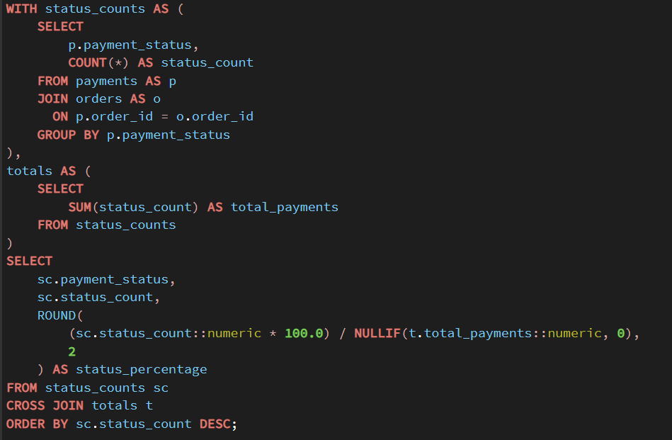

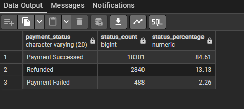

---

### **Q11: Top Performing Sellers**

**Objective:**  
Identify the top 5 sellers by total sales value and calculate their order completion success rates (excluding in-progress and returned orders).

**Business Insight:**  
Recognize high-performing sellers while monitoring quality. Address sellers with high cancellation rates through coaching or performance management.

**Techniques Used:** CTEs with ranking, CASE expressions, complex grouping, success rate calculations

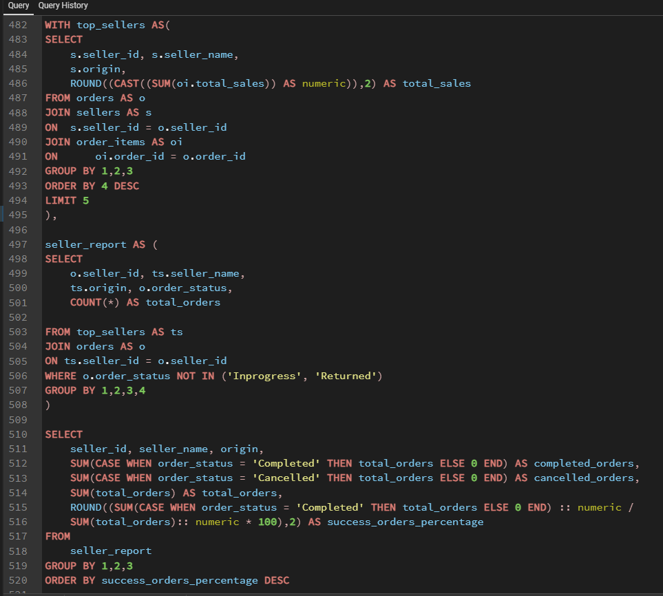


---

### **Q12: Calculate Profit Margin**

**Objective:**  
Calculate the profit margin for each product (price - cost of goods) multiplied by quantity sold, ranked from highest to lowest.

**Business Insight:**  
Identify profitable vs. low-margin products. Focus on optimizing procurement for low-margin items or adjusting pricing for better profitability.

**Techniques Used:** Profit calculations, multi-table joins, aggregate functions, descending sort for priority ranking

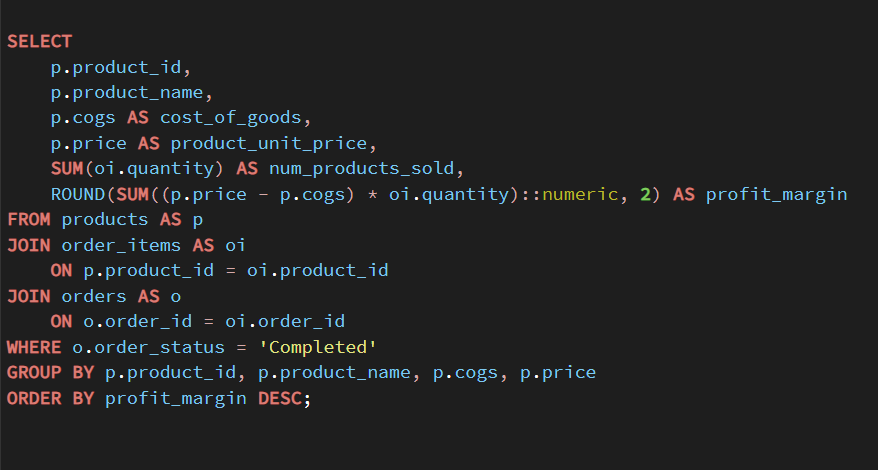

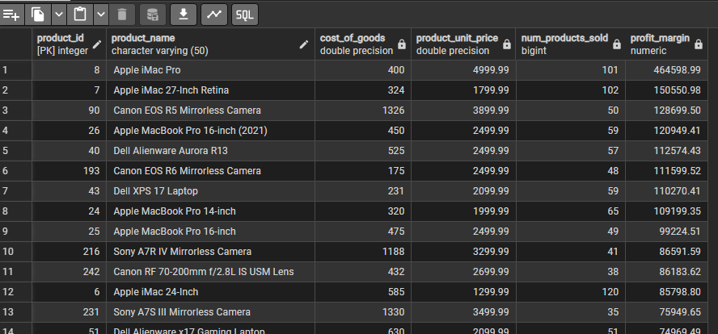

---

### **Q13: Most Returned Products**

**Objective:**  
Find the top 10 products with the highest return rates as a percentage of units sold.

**Business Insight:**  
Investigate root causes of returns (quality issues, incorrect descriptions, defects). Implement corrective actions or consider delisting problematic products.

**Techniques Used:** CASE expressions, NULLIF for division safety, percentage calculations, LIMIT for top-N results

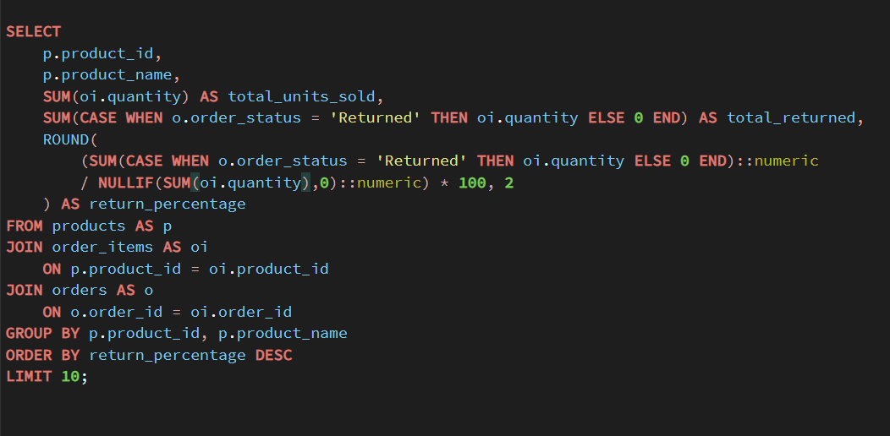

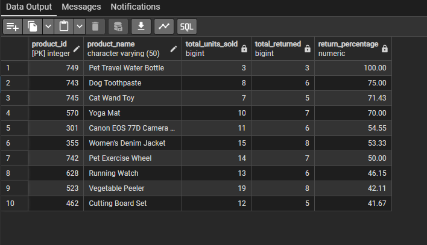

---

### **Q14: Inactive Sellers**

**Objective:**  
Identify sellers with no sales in the last 12 months and show their last sale date and amount.

**Business Insight:**  
Reach out to inactive sellers to understand barriers, offer support, or remove them from the active seller roster to maintain platform quality.

**Techniques Used:** CTEs with NOT IN filtering, date calculations with INTERVAL, MAX aggregation for timestamps

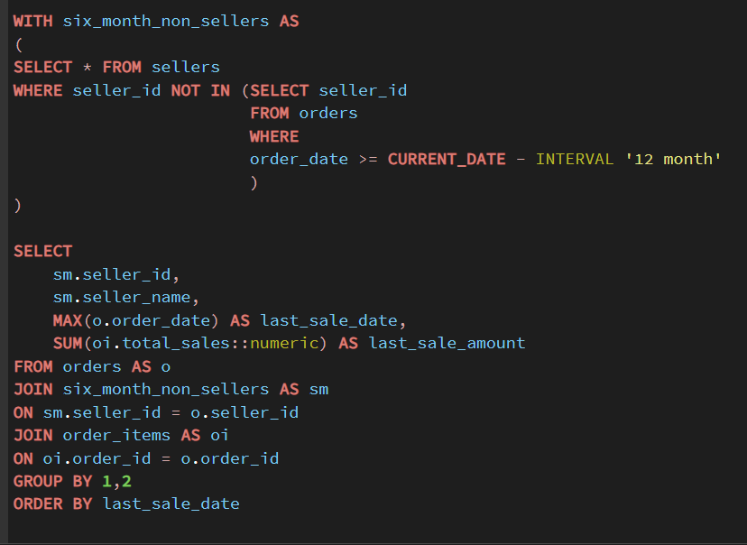

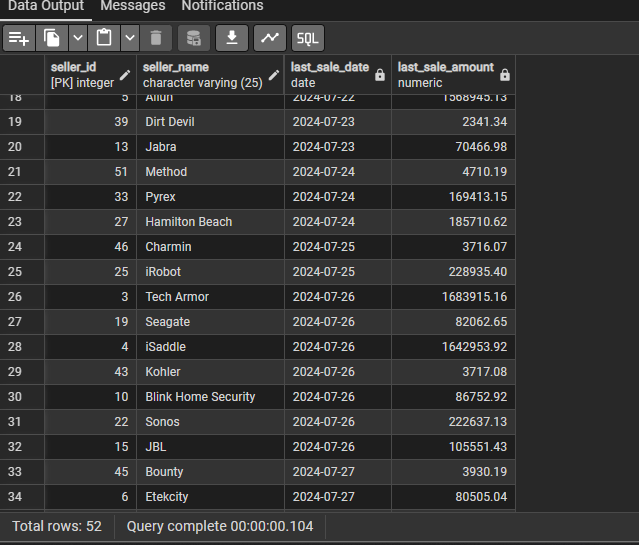

---

### **Q15: Classify Customers into Returning or New**

**Objective:**  
Classify customers as "Returning" (>5 returns) or "New" (≤5 returns) and rank top 10 by total returns.

**Business Insight:**  
Segment customers for targeted interventions. Understand if high return rates indicate product quality issues or customer behavior patterns.

**Techniques Used:** CTEs, window functions (RANK), CASE expressions for classification, conditional counting

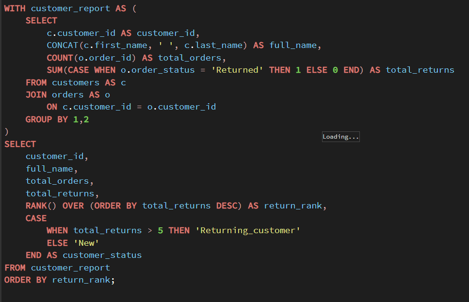

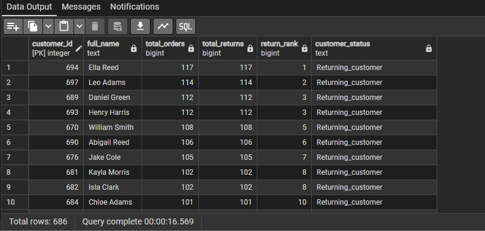

---

### **Q16: Top 5 Customers by Orders in Each State**

**Objective:**  
Identify the top 5 customers per state with the highest sales value among completed/in-progress orders.

**Business Insight:**  
Implement state-level VIP programs and regional marketing campaigns tailored to top customers. Improve retention of high-value regional accounts.

**Techniques Used:** CTEs, window functions (RANK with PARTITION BY), regional grouping, order filtering

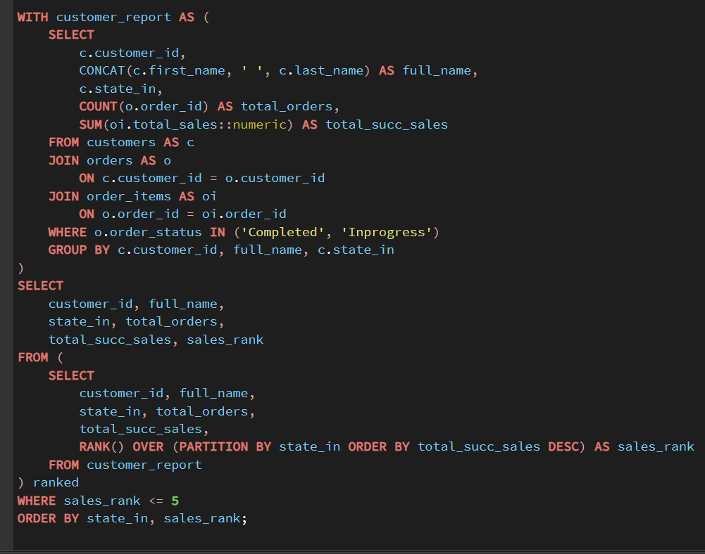

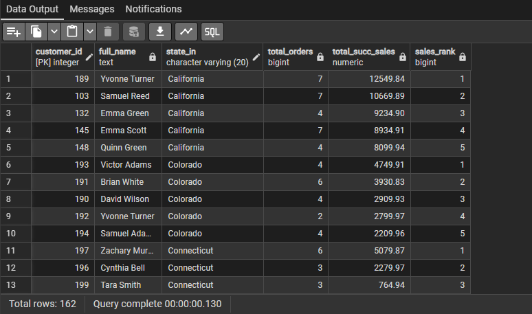

---

### **Q17: Revenue by Shipping Provider**

**Objective:**  
Calculate total revenue, order count, and average delivery time for each shipping provider.

**Business Insight:**  
Evaluate shipping partner performance across multiple dimensions (volume, revenue, speed). Make data-driven decisions on provider partnerships and rate negotiations.

**Techniques Used:** Multi-table joins, aggregate functions, date arithmetic for delivery time, sorting by revenue

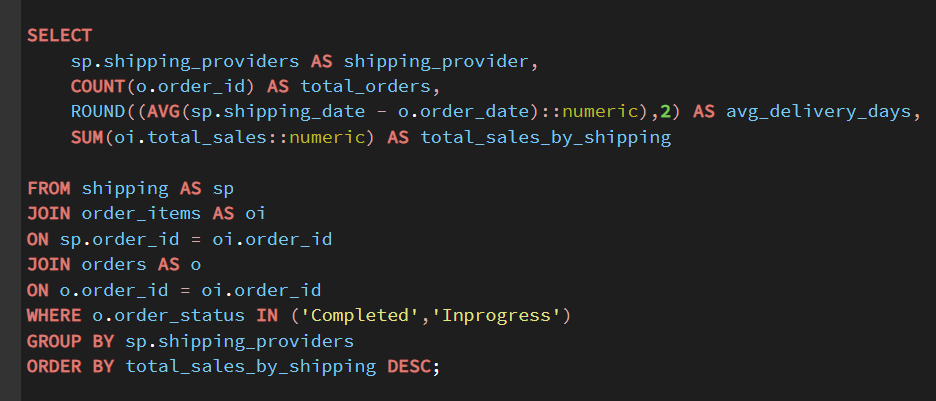

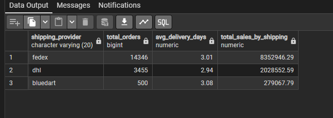

---

### **Q18: Top 10 Products with Highest Decreasing Revenue Ratio**

**Objective:**  
Calculate year-over-year revenue decline from 2022 to 2023 and rank products with the largest percentage decrease.

**Business Insight:**  
Identify declining products requiring strategic intervention: price adjustments, marketing refreshes, discontinuation, or market repositioning.

**Techniques Used:** CTEs for year-level aggregations, complex percentage calculations, NULLIF for safety, RANK window function, year-based filtering

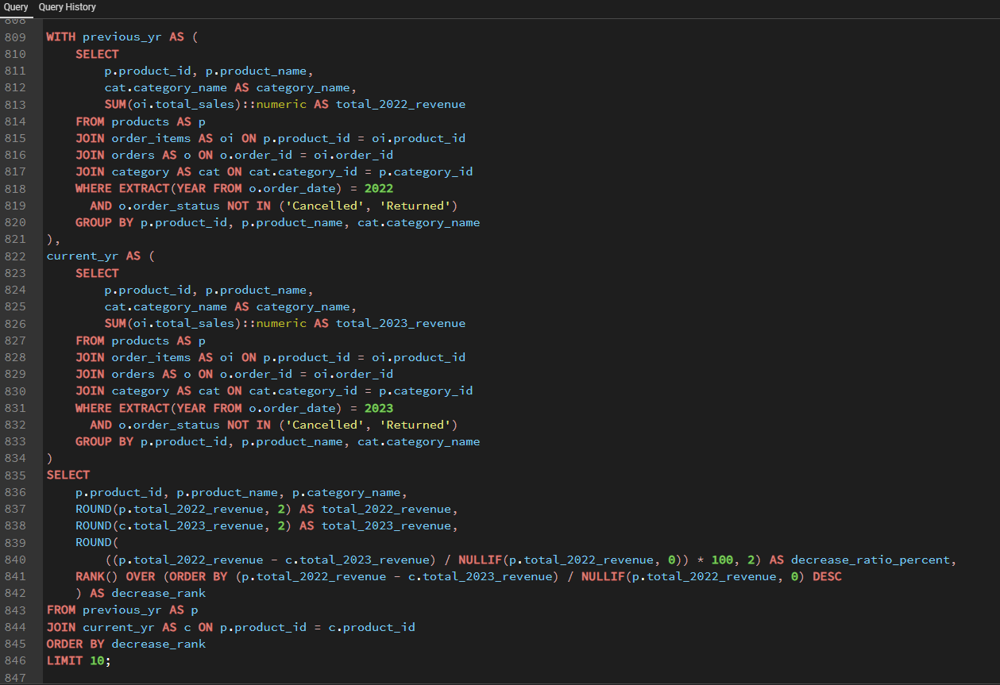

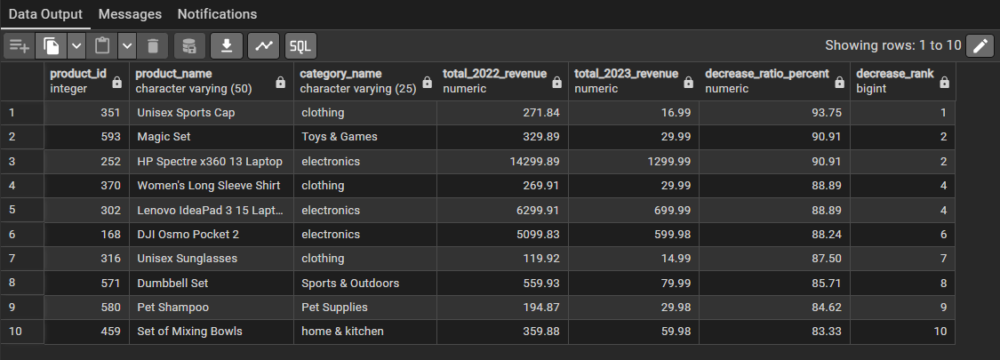

---

### **Q19: Store Procedure for Inventory Management**

**Objective:**  
Create a PL/pgSQL stored procedure that automatically updates inventory stock when a product is sold.

**Business Insight:**  
Automate inventory management to maintain real-time stock accuracy, prevent overselling, and reduce manual data entry errors.

**Techniques Used:**
- PL/pgSQL procedure creation
- Input parameters and error handling
- Conditional logic (IF/ELSE)
- Multiple INSERT statements
- UPDATE operations
- DECLARE and RAISE NOTICE for user feedback

**Procedure Features:**
- Validates product availability before processing
- Inserts records into orders and order_items tables
- Updates inventory stock automatically
- Provides detailed notices for success and failure scenarios
- Prevents stockouts through inventory checks

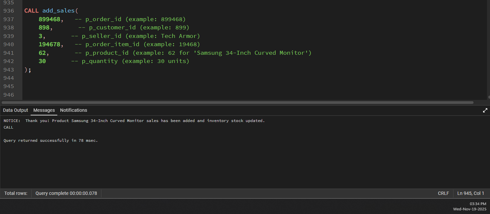

---

## **🛠️ Technologies Used**

- **Database:** PostgreSQL
- **Query Language:** SQL (PostgreSQL dialect)
- **Techniques:** CTEs, Window Functions, Aggregate Functions, Complex Joins, Stored Procedures, Date Arithmetic
- **Advanced Features:** PL/pgSQL, CASE Expressions, Subqueries, PARTITION BY, LAG/RANK functions

---

## **📁 Repository Structure**

```
AmazonSQL-Analytics/
├── 1_business_problems.sql      # Complete SQL queries for all 19 business problems
├── README.md                     # This documentation
└── outputs/
    ├── SCHEMA.png               # Database schema diagram
    ├── q_1.png to q_19.png     # Question screenshots
    ├── q_1_output.png to q_19_output.png  # Query result screenshots
    └── q_19_output_1.png        # Additional result screenshot for Q19
```

---

## 🎯 **Key Features**

✅ **Production-Ready Queries** - All queries tested and optimized for PostgreSQL  
✅ **Real-World Business Problems** - Practical scenarios from e-commerce analytics  
✅ **Advanced SQL Techniques** - Window functions, CTEs, complex joins, and stored procedures  
✅ **Well-Documented** - Each query includes comments explaining logic and steps  
✅ **Visual Results** - Screenshots of each question and output for quick reference  
✅ **Scalable Solutions** - Queries designed to handle enterprise-scale datasets  

---

## 💡 **Learning Outcomes**

- How to perform complex multi-table joins efficiently
- Advanced window functions (ROW_NUMBER, RANK, DENSE_RANK, LAG)
- Creating and managing CTEs for readable, modular queries
- Calculating business metrics (AOV, CLTV, profit margins, return rates)
- Building stored procedures for automated data processing
- Optimizing queries for performance on large datasets
- Date/time operations and interval calculations
- Conditional aggregations with CASE statements
- Percentage and ratio calculations safely with NULLIF

---

## **🚀 Getting Started**

1. Clone this repository
2. Review the `1_business_problems.sql` file
3. Execute queries against your PostgreSQL database (ensure schema matches)
4. Refer to the README sections for business context and expected outputs
5. Adapt queries to your specific business requirements

---

## 📊 **Use Cases**

- **E-commerce Analytics:** Track sales, revenue, and customer behavior
- **Inventory Management:** Monitor stock levels and prevent stockouts
- **Seller Performance:** Evaluate and rank seller success metrics
- **Customer Insights:** Segment and target customers effectively
- **Shipping Optimization:** Evaluate provider performance and delivery times
- **Financial Analysis:** Calculate margins, profits, and revenue contributions
- **Quality Assurance:** Identify products with high return rates

---

## 📝 **Notes**

- All queries are optimized for PostgreSQL 12+
- Ensure your database schema matches the structure referenced in the queries
- Some queries filter for specific date ranges; adjust INTERVAL values as needed
- Test all queries in a development environment before running in production
- Review execution plans for optimization opportunities on large datasets

---

**Created with ❤️ for SQL enthusiasts and data professionals**
